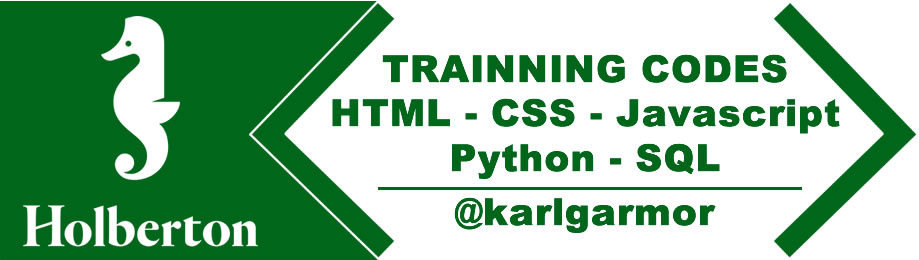

# Higher Level Programming

A high-level language is a programming language designed to simplify computer programming. It is "high-level" since it is several steps removed from the actual code run on a computer's processor. High-level source code contains easy-to-read syntax that is later converted into a low-level language, which can be recognized and run by a specific CPU.

# Content

- [0x00-python-hello_world](0x00-python-hello_world/)
- [0x01-python-if_else_loops_functions](0x01-python-if_else_loops_functions/)
- [0x02-python-import_modules](0x02-python-import_modules/)
- [0x03-python-data_structures](0x03-python-data_structures/)
- [0x04-python-more_data_structures](0x04-python-more_data_structures/)
- [0x05-python-exceptions](0x05-python-exceptions/)
- [0x06-python-classes](0x06-python-classes/)
- [0x07-python-test_driven_development](0x07-python-test_driven_development/)
- [0x08-python-more_classes](0x08-python-more_classes/)
- [0x09-python-everything_is_object](0x09-python-everything_is_object/)
- [0x0A-python-inheritance](0x0A-python-inheritance/)
- [0x0B-python-input_output](0x0B-python-input_output/)
- [0x0C-python-almost_a_circle](0x0C-python-almost_a_circle/)
- [0x0D-SQL_introduction](0x0D-SQL_introduction/)
